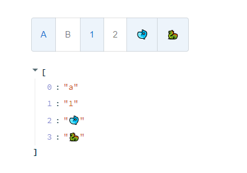

# streamlit-toggle-button-set

A button can be used to group related options (multi-select & single select), inspired by React Material UI.

## Installation instructions

```sh
pip install streamlit-toggle-button-set
```

## Usage instructions



```python
import streamlit as st
from toggle_button_set import toggle_button_set

outcome = toggle_button_set(
    button_list=['a', 'b', '1', '2'],
    default=['a', '1'],
    color="primary",
    size="large",
    exclusive=False,
    use_container_width=False
)

st.write(outcome)
```

## Arguments

### Required:

- _button_list_

### Optional:

- _default = []_ - must be a subset of _button_list_, these options are automatically selected upon boot.
- _color = "standard"_ - The color of the button when it is selected, options includes 'standard', 'primary', 'secondary', 'error', 'info', 'success' and 'warning'.
- _size = "medium"_ - The size of the component, options includes 'small', 'medium' and 'large'.
- _exclusive = False_ - forces only one item to be selected from _button_list_.
- _use_container_width = False_ - will make the component take up the full width of its container.
- _key = None_ - optional key
